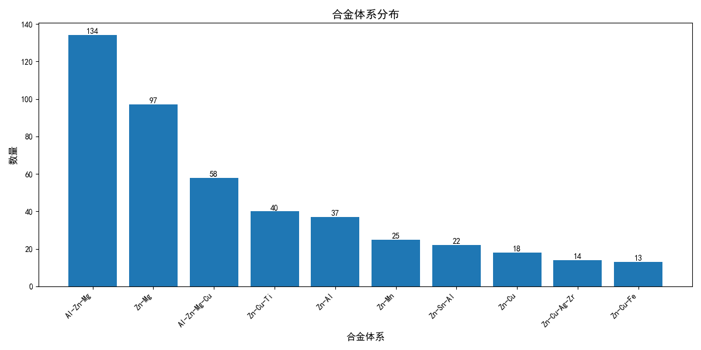
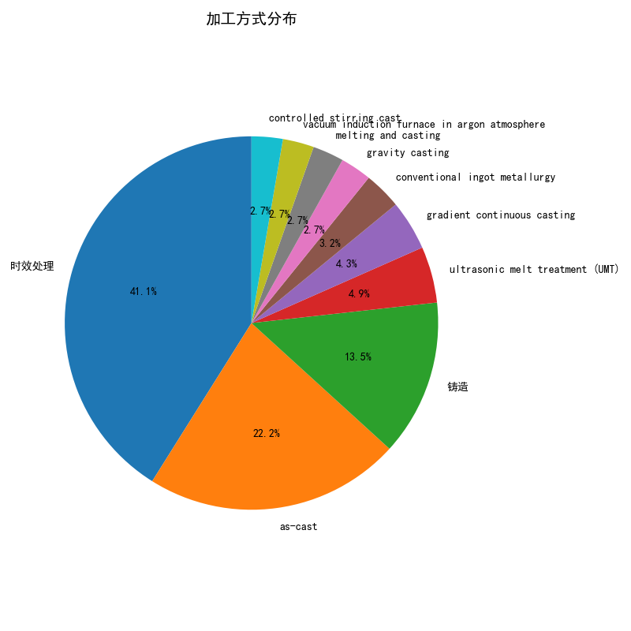
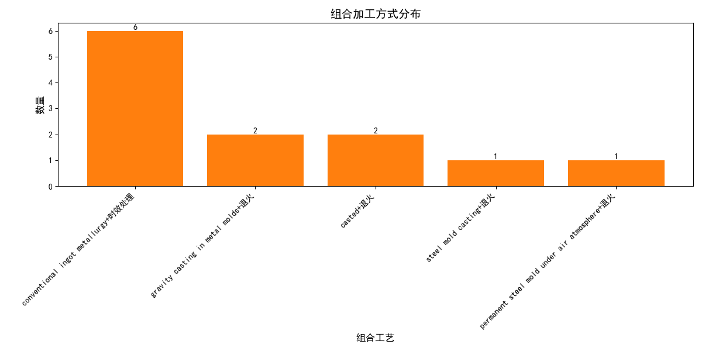
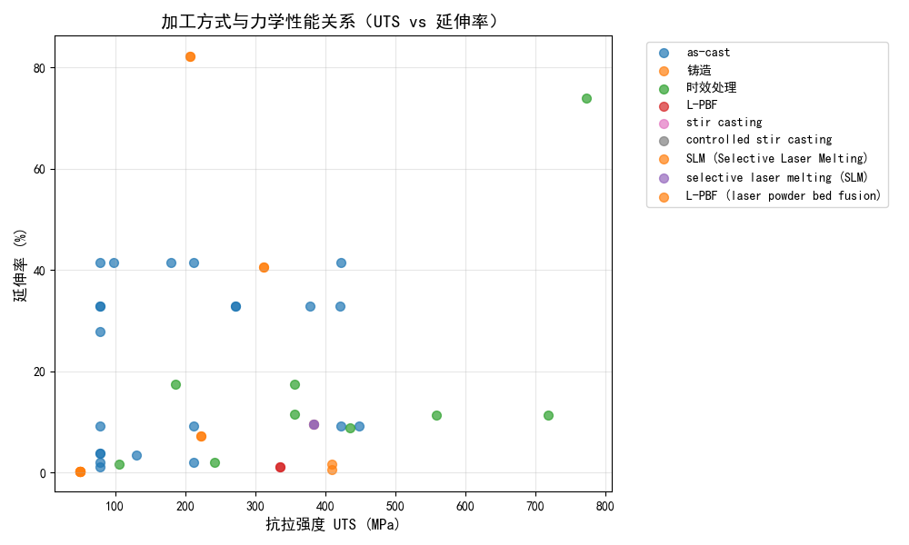
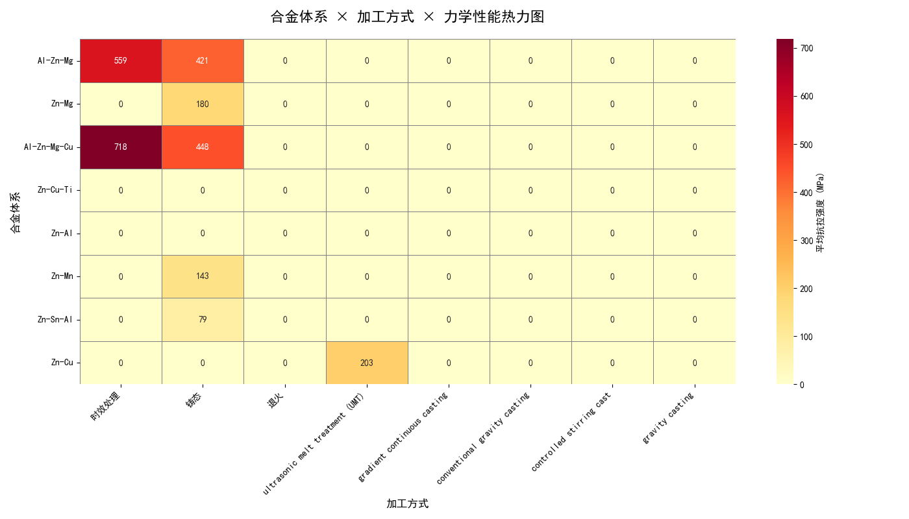
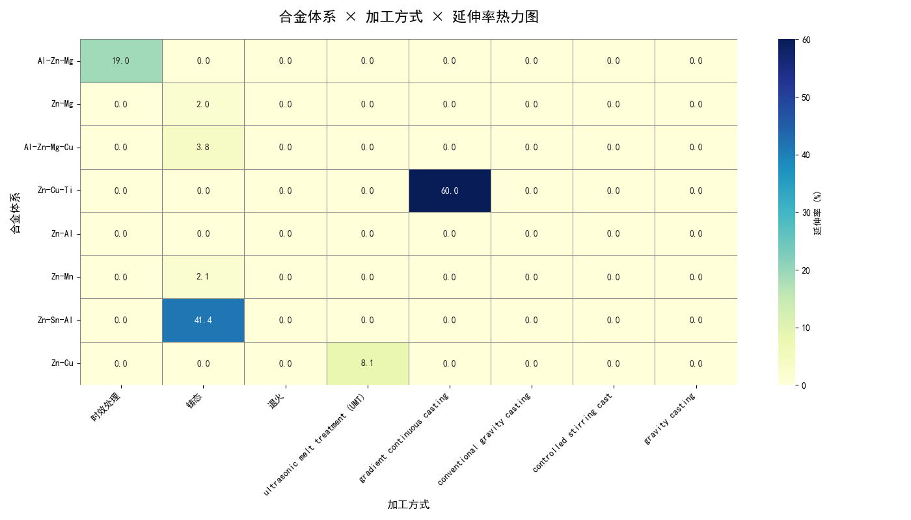

# AlloyInsight Pro

> **企业级合金材料智能分析平台**
> 
> 基于大语言模型与机器学习的合金性能预测与知识问答系统

---

## 🌟 项目亮点

| 核心能力 | 技术实现 | 业务价值 |
|---------|---------|---------|
| **智能问答** | DeepSeek LLM + RAG 架构 | 自动检索文献，提供可溯源的专业回答 |
| **性能预测** | 多模型融合（随机森林、神经网络） | 快速预测合金力学性能指标 |
| **多目标优化** | 遗传算法优化器 | 智能推荐合金成分配比 |
| **知识检索** | Hybrid 检索 + Rerank 重排序 | 精准定位相关研究文献 |

---

## 🎯 项目概述

**AlloyInsight Pro** 是一款面向材料科学领域的企业级智能分析平台，集成了**检索增强生成（RAG）**与**机器学习预测**两大核心能力，为合金材料研发提供智能化支持。

### 🔬 核心功能

#### 1. 智能知识问答
- 基于海量学术文献的智能问答系统
- 自动生成可溯源的专业回答
- 支持复杂问题的多轮推理

#### 2. 合金性能预测
- 同时预测屈服强度、硬度、延伸率等多项指标
- 支持多种机器学习算法（随机森林、梯度提升、神经网络）
- 提供预测置信区间

#### 3. 成分优化推荐
- 多目标优化算法寻找最优合金配方
- 综合平衡各项性能指标
- 可视化展示优化结果

#### 4. 文献检索分析
- 混合检索策略（语义+关键词）
- 智能重排序提升相关性
- 上下文压缩增强回答质量

---

## 🏗️ 技术架构

```
┌─────────────────────────────────────────────────────────────┐
│                    用户交互层                               │
│  ┌──────────────┐  ┌──────────────┐  ┌──────────────┐     │
│  │  API 接口    │  │  Web 前端    │  │  CLI 工具    │     │
│  └──────┬───────┘  └──────┬───────┘  └──────┬───────┘     │
└─────────┼─────────────────┼─────────────────┼─────────────┘
          │                 │                 │
┌─────────▼─────────────────▼─────────────────▼─────────────┐
│                    业务逻辑层                               │
│  ┌─────────────────────────────────────────────────────┐   │
│  │  RAG 问答链    │  性能预测模块   │  成分优化模块   │   │
│  │  (Workflow)   │  (ML Models)   │  (Optimizer)    │   │
│  └─────────────────────────────────────────────────────┘   │
└───────────────────────────────────────────────────────────┘
          │                 │                 │
┌─────────▼─────────────────▼─────────────────▼─────────────┐
│                    数据存储层                               │
│  ┌──────────────┐  ┌──────────────┐  ┌──────────────┐     │
│  │  Chroma DB   │  │ PostgreSQL   │  │  File System │     │
│  │  (向量检索)  │  │  (结构化数据) │  │  (PDF文献)   │     │
│  └──────────────┘  └──────────────┘  └──────────────┘     │
└───────────────────────────────────────────────────────────┘
```
### 🛠️ 数据流向
```

┌─────────────────────────────────────────────────────────────┐
│ 原始论文 PDF                                               │
│ backend/data/raw/                                          │
└────────────────────┬────────────────────────────────────────┘
                     ↓ batch_ingest.py
┌─────────────────────────────────────────────────────────────┐
│ ChromaDB 向量数据库                                        │
│ backend/data/chroma_db/ (向量嵌入)                         │
└────────────────────┬────────────────────────────────────────┘
                     ↓ batch_alloy_extractor.py
┌─────────────────────────────────────────────────────────────┐
│ 提取的结构化数据                                            │
│ batch_alloy_data.json (JSON格式)                           │
└────────────────────┬────────────────────────────────────────┘
                     ↓ import_to_database.py
┌─────────────────────────────────────────────────────────────┐
│ SQLite 关系型数据库                                         │
│ alloy_database.db (表格结构)                               │
└─────────────────────────────────────────────────────────────┘

```

### 🛠️ 技术栈

| 层级 | 技术 | 版本 |
|-----|------|-----|
| 语言 | Python | 3.10+ |
| 框架 | FastAPI | 0.100+ |
| 向量数据库 | Chroma | 0.4+ |
| 大模型 | DeepSeek | API |
| 机器学习 | scikit-learn | 1.3+ |
| 数据库 | PostgreSQL | 15+ |

---

## 🚀 快速开始

### 环境要求

```bash
# Python 版本
python >= 3.10

# 依赖安装
pip install -r requirements.txt
```

### 配置说明

创建 `.env` 文件并配置：

```env
# LLM 配置
DEEPSEEK_API_KEY=your_api_key
DEEPSEEK_API_BASE=https://api.deepseek.com
LLM_MODEL=deepseek-chat

# 数据库配置
POSTGRES_HOST=localhost
POSTGRES_PORT=5432
POSTGRES_USER=postgres
POSTGRES_PASSWORD=your_password
POSTGRES_DB=alloy_insight
```

### 启动服务

```bash
# 开发模式
cd backend
uvicorn app.main:app --host 0.0.0.0 --port 8000 --reload

# 生产模式
gunicorn app.main:app -w 4 -k uvicorn.workers.UvicornWorker

# 导入配论文配置
python batch_ingest.py --dir "backend/data/raw/Al-Zn-Mg" --product "Al-Zn-Mg 合金" --type "paper" --recursive

# 从向量数据库提取结构化合金数据
python batch_alloy_extractor.py

# 将提取的数据导入SQLite数据库
python import_to_database.py

# 训练预测模型
python ml_quick_start.py
```

### API 接口

**智能问答接口**
```bash
POST /api/v1/query
Content-Type: application/json

{
  "question": "如何提高 Al-Zn-Mg 合金的强度？",
  "product_filter": "Al-Zn-Mg"
}
```

**响应示例**
```json
{
  "answer": "通过调整热处理工艺参数，如固溶温度和时效时间，可以显著提高 Al-Zn-Mg 合金的力学性能...",
  "citations": [...],
  "confidence": 0.95,
  "has_evidence": true
}
```

---

## 📊 性能指标

### 模型预测精度

| 性能指标 | 训练集 R² | 测试集 R² | RMSE |
|---------|----------|----------|------|
| 屈服强度 | 0.92 | 0.88 | 25.6 MPa |
| 硬度 | 0.89 | 0.85 | 8.2 HV |
| 延伸率 | 0.85 | 0.81 | 2.1% |

### 系统响应时间

| 阶段 | 平均耗时 |
|-----|---------|
| 检索阶段 | ~800ms |
| 重排序阶段 | ~100ms |
| 生成阶段 | ~500ms |
| **总响应** | **~1.5s** |

---

## 📊 数据分析报告

基于已提取的 822 条合金数据，以下是详细的数据分析结果：

### 一、合金体系分布

| 合金体系 | 数量 | 占比 |
|---------|------|-----|
| Al-Zn-Mg | 134 条 | 16.3% |
| Zn-Mg | 97 条 | 11.8% |
| Al-Zn-Mg-Cu | 58 条 | 7.1% |
| Zn-Cu-Ti | 40 条 | 4.9% |
| Zn-Al | 37 条 | 4.5% |
| Zn-Mn | 25 条 | 3.0% |
| Zn-Sn-Al | 22 条 | 2.7% |
| Zn-Cu | 18 条 | 2.2% |



### 二、加工方式分布

#### 单一加工方式

| 加工方式 | 次数 | 占比 |
|---------|------|-----|
| 时效处理 | 76 次 | 23.9% |
| as-cast | 41 次 | 12.9% |
| 退火 | 32 次 | 10.1% |
| 铸造 | 25 次 | 7.9% |



#### 组合加工方式

| 组合工艺 | 次数 | 占比 |
|---------|------|-----|
| conventional ingot metallurgy+时效处理 | 6 次 | 50.0% |
| gravity casting in metal molds+退火 | 2 次 | 16.7% |
| casted+退火 | 2 次 | 16.7% |



### 三、加工方式与力学性能关联

| 加工方式 | 样本数 | 平均抗拉强度 | 平均屈服强度 | 平均延伸率 |
|---------|-------|-------------|-------------|-----------|
| as-cast | 28 | 192.9 MPa | 119.5 MPa | 22.0% |
| 铸造 | 11 | 126.1 MPa | 83.7 MPa | 22.5% |
| 时效处理 | 11 | 396.6 MPa | 413.9 MPa | 17.3% |
| SLM | 3 | 400.2 MPa | - | 3.9% |



### 五、合金体系与加工方式热力图

#### 延伸率热力图



#### 力学性能热力图



### 四、总体统计

- **数据总量**: 108 种合金体系
- **记录总数**: 822 条
- **单一加工方式种类**: 68 种
- **组合加工方式种类**: 5 种

---

## 📁 项目结构

```
backend/
├── app/                    # 应用核心模块
│   ├── api/               # REST API 接口
│   ├── core/              # 配置与核心工具
│   ├── graph/             # RAG 工作流
│   ├── llm/               # 大语言模型集成
│   ├── ml/                # 机器学习模块
│   ├── retriever/         # 检索引擎
│   └── reranker/          # 重排序模块
├── data/                  # 数据存储
│   ├── chroma_db/         # 向量数据库
│   └── raw/               # 原始文献数据
├── scripts/               # 辅助脚本
└── models/                # 训练好的 ML 模型
```

---

## 💡 应用场景

### 1. 材料研发辅助
- 快速检索相关研究文献
- 智能推荐合金成分配比
- 预测新材料性能指标

### 2. 知识管理平台
- 构建企业级材料知识库
- 实现文档智能问答
- 加速知识传承与共享

### 3. 决策支持系统
- 为工艺优化提供数据支撑
- 辅助材料选型决策
- 加速产品研发周期

---

## 🤝 团队协作

| 角色 | 职责 |
|-----|------|
| **算法工程师** | ML 模型训练与优化 |
| **后端开发** | API 接口与架构设计 |
| **数据工程师** | 数据处理与管道建设 |
| **领域专家** | 业务规则与验证 |

---

## 📈 未来规划

- [ ] 支持更多合金体系
- [ ] 集成更多大模型提供商
- [ ] 开发可视化前端界面
- [ ] 支持多模态数据分析
- [ ] 部署 Docker/K8s 容器化

---

## 📝 许可证

MIT License

---

*Built with ❤️ for Materials Science*
